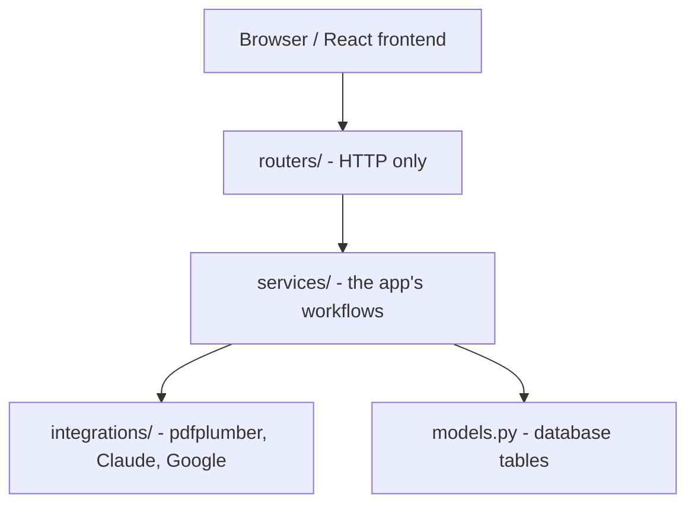
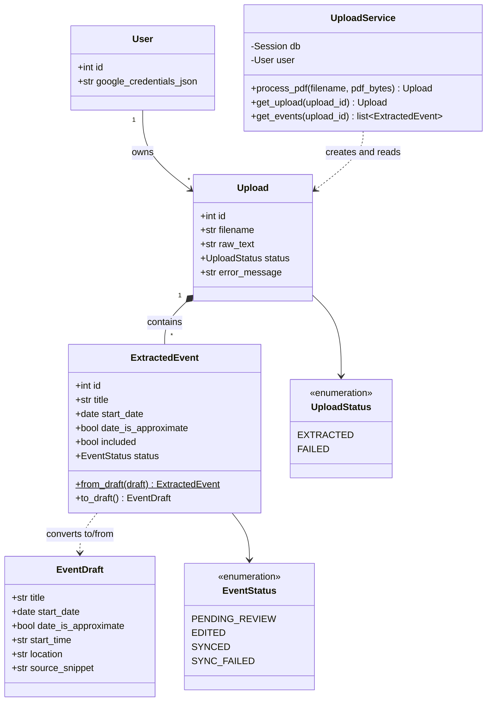
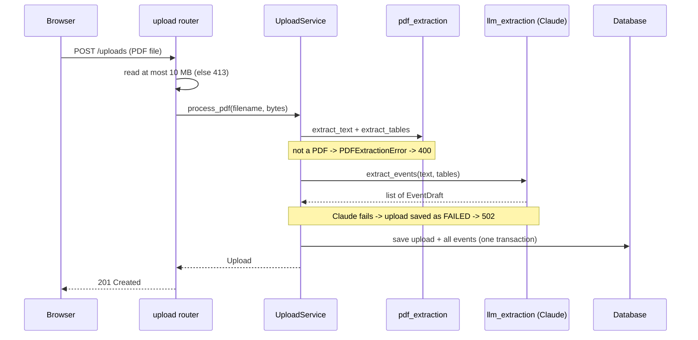
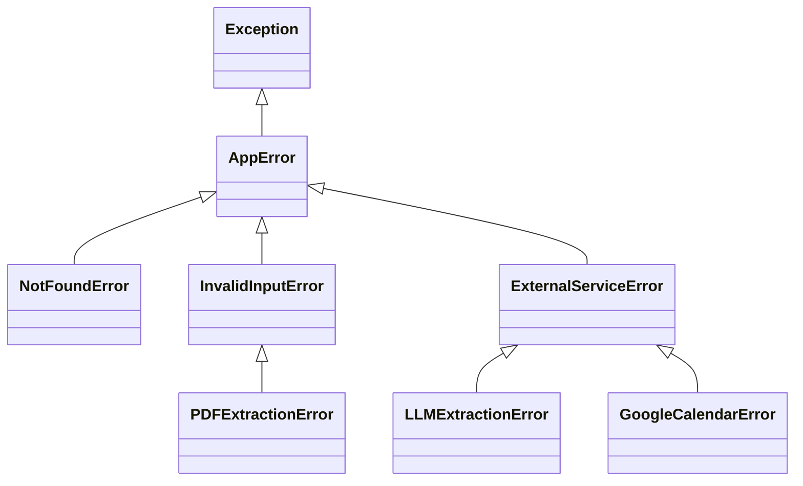

# Architecture

This document explains how Calendar PDF Sync is put together and why I made the design
choices I did. It's meant to be readable in a few minutes: the big picture first, then the
main classes, then the decisions and trade-offs.

## What the app does

You upload a course schedule or syllabus PDF. The backend pulls the text and tables out of
it, asks Claude to turn them into structured calendar events, and saves them. You review the
events (fix dates, untick ones you don't want), then sync the rest to Google Calendar.

The review step is the core idea. An LLM will sometimes misread a table or guess a date, so
nothing reaches your real calendar until a person has looked at it.

## The big picture: layers

The backend is split into layers, and each layer only talks to the ones below it.



| Layer | Job | Example |
|---|---|---|
| `routers/` | Read the HTTP request, call a service, return a response | `POST /uploads` reads the file and enforces the 10 MB limit |
| `services/` | The app's own rules and workflows | `UploadService.process_pdf()` - extract, save, handle failures |
| `integrations/` | Wrap someone else's system | `llm_extraction.py` talks to Claude, `google_calendar.py` to Google |
| `models.py` | How data is stored | `Upload`, `ExtractedEvent`, `User` tables |
| `domain.py`, `errors.py` | Types every layer shares | `EventDraft`, `EventStatus`, the exception hierarchy |

The rule is that imports only point *down*. A router can import a service, but a service
never imports a router, and nothing in `integrations/` knows the database exists. In CPSC 210
we talked a lot about **cohesion** (each class/module does one focused job) and **coupling**
(how much modules depend on each other's details). The layers are my way of getting high
cohesion and low coupling: if Google changes its API, only `google_calendar.py` should change.

`domain.py` and `errors.py` sit underneath everything. They don't import FastAPI, SQLAlchemy,
Claude, or Google, so any layer can use them without dragging those libraries along.

## Folder layout

```
backend/app/
  main.py            wires everything together: routers, error handlers, startup
  config.py          settings loaded from .env (API keys, database URL)
  db.py              database engine and sessions
  dependencies.py    FastAPI dependencies: the current user, services
  domain.py          EventDraft + status enums
  errors.py          the exception hierarchy
  models.py          SQLAlchemy tables
  schemas.py         what the API sends back (separate from the tables on purpose)
  routers/           auth.py, upload.py, events.py
  services/          upload_service.py, users.py
  integrations/      pdf_extraction.py, llm_extraction.py, google_calendar.py
```

## Main classes

This is a UML-style class diagram, like the ones we drew in CPSC 210 (only the important
fields are shown).



**`EventDraft` vs `ExtractedEvent`.** These look similar but have different jobs.
`EventDraft` is "an event" with no connection to storage: it's what Claude produces and what
the Google Calendar code consumes. `ExtractedEvent` is the database row, which adds things
only storage cares about (an `id`, which upload it belongs to, whether it's been synced). The
row knows how to convert itself (`from_draft` / `to_draft`), so that logic lives with the
data it works on instead of in a separate helper module.

**`UploadService`** is created fresh for every request with the database session and the
current user passed into its constructor. It doesn't create those itself, which is what makes
it easy to test with a throwaway database.

## How an upload works



## Error handling

Errors are grouped by *what kind of failure* it is, not by which library failed:



`main.py` registers one handler for `AppError` and maps each category to an HTTP status
(`NotFoundError` -> 404, `InvalidInputError` -> 400, `ExternalServiceError` -> 502). This is the
same idea as the exception hierarchies from CPSC 210: code that handles the parent type
automatically handles every subclass. Adding a new error just means picking the right parent,
and no router needs a `try/except`. The error classes themselves don't know about HTTP, so
they could be reused by something that isn't a web server.

## Design decisions

**One transaction per upload (all or nothing).** An upload and its ~60 events are saved in a
single commit. If something fails halfway, nothing is saved, so there are never half-finished
uploads. The exception is on purpose: when Claude fails, the upload is saved with status
`FAILED` and its raw text, so I can see exactly what Claude was given when I tune the prompt.

**Statuses are enums, checked by the database too.** Statuses like `"synced"` used to be
strings typed out in several files, where a typo would silently match nothing. Now they're
`StrEnum`s defined once in `domain.py`, and the database columns have a `CHECK` constraint,
so even buggy code can't store an unknown status. Two layers of protection for one rule.

**Schemas are separate from models.** The API response types (`schemas.py`) list exactly which
fields leave the server. `raw_text` is never sent back, and no schema includes the user's
Google tokens, so a new route can't leak them by accident.

**Dependency injection for services.** Routes ask FastAPI for what they need
(`Depends(get_upload_service)`) instead of building it. `get_current_user` in
`dependencies.py` is the only place that knows the app currently has one user; supporting
real accounts later means changing that one function.

**Ownership checks return 404, not 403.** `UploadService.get_upload` checks that the upload
belongs to the current user. With one user this never fails, but with many it stops someone
reading other people's uploads by changing the ID in the URL (an "IDOR" bug). Returning 404
means the app doesn't even confirm the upload exists.

**No repository layer (on purpose).** Some architectures put every database query in a
separate repository class. At this size that would just add another layer to click through,
so services use the SQLAlchemy session directly. If the queries grow, that's where I'd split
them out.

## Testing

- Every test gets its own empty in-memory SQLite database (`tests/conftest.py`), so tests can't
  affect each other or my real data.
- Claude and Google are replaced with fakes in unit tests, so tests are fast, free, and don't
  need the internet.
- There are tests at each layer: the domain types, the models (including that the database
  really rejects a bad status), the integrations, and `UploadService`'s whole workflow
  including the failure paths.
- Run them from `backend/` with `pytest`.

## Known limitations and future work

- **Provider interfaces.** The Claude and Google code are plain modules. If I wanted to support
  another calendar (e.g. Outlook) or AI provider, I'd define interfaces like `CalendarProvider`
  and inject the implementation, which would also make the tests less dependent on file paths.
  I left this out for now because I only need one of each.
- **Database migrations.** `create_all` can create tables but can't change existing ones, so a
  schema change currently means recreating the local database. A migration tool (Alembic) is the
  proper fix once there's real data to keep.
- **Slow requests.** Extraction takes around a minute and the browser waits for it. A background
  job with a progress indicator would be a better experience.
- **Table reading.** Claude sometimes misreads which weekday a column belongs to. The review
  step catches this, but improving the prompt is ongoing.
